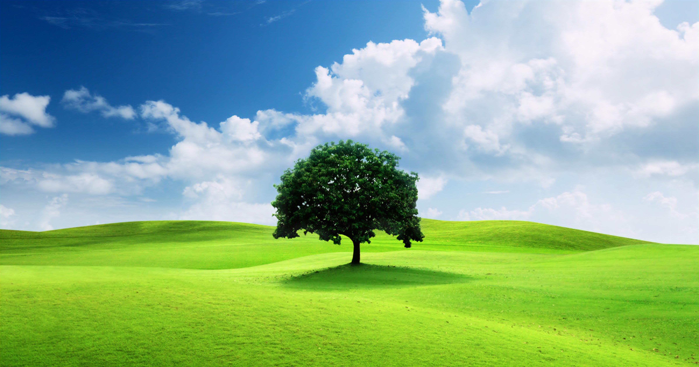
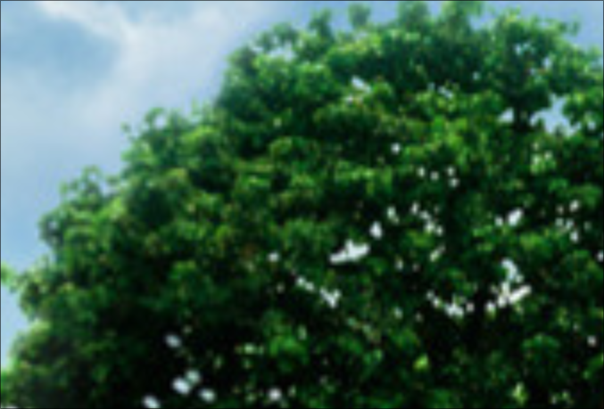
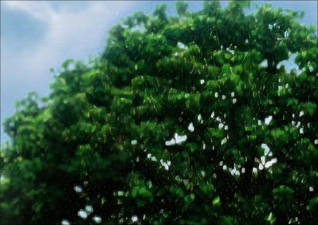

Para no tener que entrenar el modelo hacer uso del checkpoint_epoch_70.pth, en base a este
hacer el escalado de cualquier imagen. El checkpoint pesa casi 300MB, no es posible subirlo a git,
así que se proporciona un link para su descarga: https://drive.google.com/drive/folders/1ls7agCZf1gINa6KbFp79RVpuRtOCGJtu?usp=sharing

Si quieres entrenar el modelo en tu pc, descargar el dataset de Flickr2k (unicamente este), el link está en Proyecto_RN.pdf

Espero potenciar este proyecto a un Real ESRGAN, el cual es mejor que ESRGAN (el que estoy implementando).
No me dio tiempo

Resultados finales

| Imagen original                              | Imagen escalada                              |
|-----------------------------------------------|-----------------------------------------------|
|  |  |

Haciendo zoom para ver una mayor diferencia:

| Imagen original                              | Imagen escalada                              |
|-----------------------------------------------|-----------------------------------------------|
|  |  |

| Imagen original                              | Imagen escalada                              |
|-----------------------------------------------|-----------------------------------------------|
|  |  |

| Imagen original                              | Imagen escalada                              |
|-----------------------------------------------|-----------------------------------------------|
|  |  |

