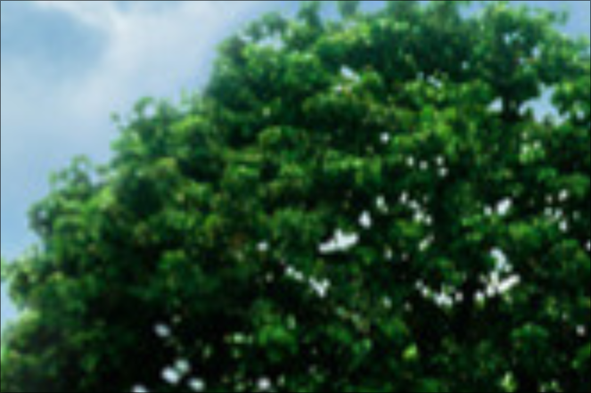
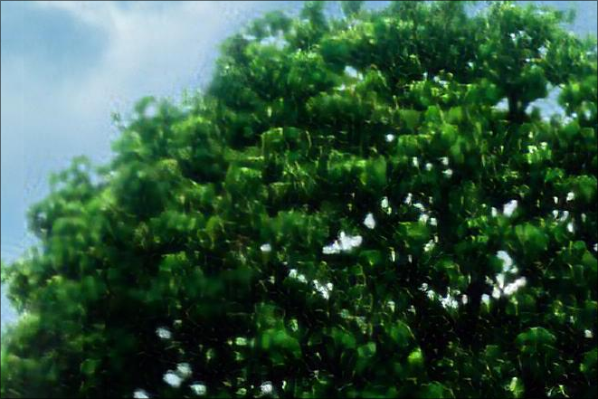
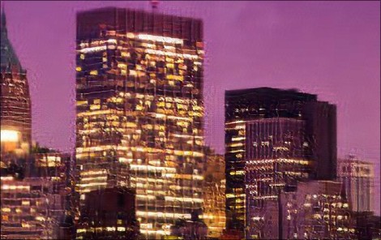

Para realizar el escalado de cualquier imagen sin necesidad de entrenar el modelo, se puede hacer uso del archivo checkpoint_epoch_40.pth. Dado que este archivo tiene un tamaño cercano a 300MB y no es posible subirlo a Git, se proporciona un enlace para su descarga: [Google Drive - checkpoints](https://drive.google.com/drive/folders/1ls7agCZf1gINa6KbFp79RVpuRtOCGJtu?usp=sharing).

Cabe mencionar que realice 2 entrenamientos: uno de 150 epocas y uno de 40 epocas, el de 40 epocas tiene mejores resultados.

Si deseas entrenar el modelo en tu propio PC, puedes descargar el dataset Flickr2k desde el enlace proporcionado en el archivo Proyecto_RN.pdf.

Resultados finales:

| Imagen original                              | Imagen escalada                              |
|-----------------------------------------------|-----------------------------------------------|
|  |  |

Haciendo zoom para ver una mayor diferencia:

| Imagen original                              | Imagen escalada                              |
|-----------------------------------------------|-----------------------------------------------|
|  |  |

| Imagen original                              | Imagen escalada                              |
|-----------------------------------------------|-----------------------------------------------|
|  |  |

| Imagen original                              | Imagen escalada                              |
|-----------------------------------------------|-----------------------------------------------|
|  |  |

## Referencias

- [ESRGAN: Enhanced Super-Resolution Generative Adversarial Networks (arXiv)](https://arxiv.org/pdf/1809.00219)

- [SRGAN: Super-Resolution Generative Adversarial Networks (openaAccess)](https://openaccess.thecvf.com/content_cvpr_2017/papers/Ledig_Photo-Realistic_Single_Image_CVPR_2017_paper.pdf)
https://arxiv.org/pdf/1603.08155
- [Perceptual Losses for Real-Time Style Transfer and Super-Resolution (arXiv)](https://openaccess.thecvf.com/content_cvpr_2017/papers/Ledig_Photo-Realistic_Single_Image_CVPR_2017_paper.pdf)

- [An Intuitive Introduction to Generative Adversarial Networks (freeCodeCamp)](https://www.freecodecamp.org/news/an-intuitive-introduction-to-generative-adversarial-networks-gans-7a2264a81394)
- [Super-Resolution Generative Adversarial Networks (PyImageSearch)](https://pyimagesearch.com/2022/06/06/super-resolution-generative-adversarial-networks-srgan/)
